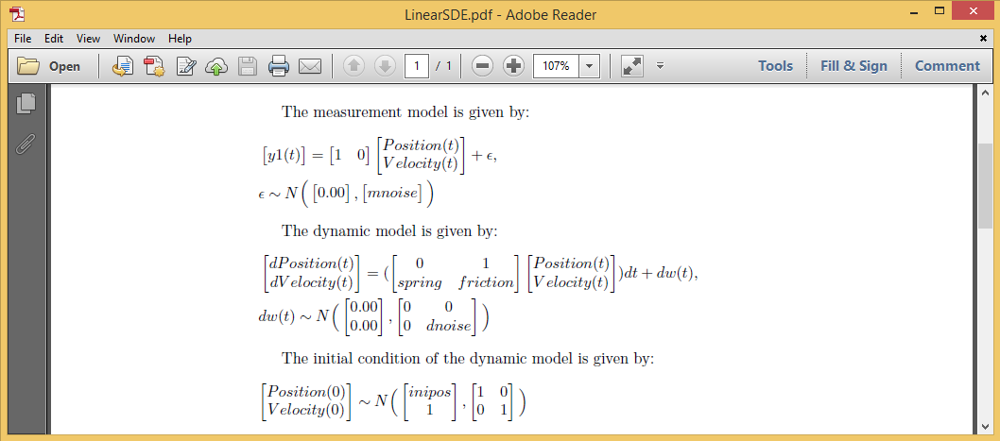

Introduction
---------------

This example illustrates how to fit a linear Stochastic differential equation (SDE) model in the `dynr` package.  

A damped linear oscillator model is estimated. Details of the model set up is as follows:

$\frac{d^2x}{dt^2} = -kx - c\frac{dx}{dt} + \zeta$

This model can also be written in the form of a vector of first-order systems:

The dynamic model is :

$$\begin{pmatrix}
\frac{dx}{dt}\\ 
\frac{d^2x}{dt^2}
\end{pmatrix} =  \begin{pmatrix}
0 & 1\\ 
-k & -c
\end{pmatrix}\begin{pmatrix}
x\\ 
\frac{dx}{dt}
\end{pmatrix} + \begin{pmatrix}
0\\ 
\zeta 
\end{pmatrix}$$

The measurement model is:

$$y = \begin{pmatrix}
1 & 0
\end{pmatrix}\begin{pmatrix}
x\\ 
\frac{dx}{dt}
\end{pmatrix} + \epsilon$$
     

Data 
---------------
We first load dynr package.

The <span style="color:blue">_dynr.data_</span> command is used to create a dynr data object.
Here the observed variable we are modeling is "y1" . (The simulated data are loaded as part of the package.)
```{r data, results="hide"}
require(dynr)
# Data
data(Oscillator)
data <- dynr.data(Oscillator, id="id", time="times", observed="y1")
```
Measurement Model
---------------
The <span style="color:blue">_prep.measurement_</span> command is used to specify the factor loadings matrix. The `values.load` argument specifies that the factor loadings are fixed at 1 and 0. In this model, all parameters are fixed, which is indicated by the `params.load` argument. The `*.names` argument gives names to the latent and observed variables.

```{r measurement, results="hide"}
meas <- prep.measurement(
	values.load=matrix(c(1, 0), 1, 2), 
	params.load=matrix(c('fixed', 'fixed'), 1, 2),
	state.names=c("Position","Velocity"),
	obs.names=c("y1"))
```

Dynamic Model
---------------

The <span style="color:blue">_prep.noise_</span> command is used to specify dynamic (`values.latent`) and observation (`values.observed`) noise components. The latent noise is the dynamic noise. The observed noise is the measurement noise.

The <span style="color:blue">_prep.matrixDynamics_</span> command is used to define the differental equation. In this model, the first row of the parameter matrix is fixed at 0 and 1 and the starting values for the second row of the matrix is set at -0.1 and -0.2.

```{r noise cov, results="hide"}
ecov <- prep.noise(
	values.latent=diag(c(0, 1), 2), params.latent=diag(c('fixed', 'dnoise'), 2), 
	values.observed=diag(1.5, 1), params.observed=diag('mnoise', 1)) 
dynamics <- prep.matrixDynamics(
	values.dyn=matrix(c(0, -0.1, 1, -0.2), 2, 2),
	params.dyn=matrix(c('fixed', 'spring', 'fixed', 'friction'), 2, 2), 
	isContinuousTime=TRUE)
```

Initial Values
---------------

This step specifies the covariances and latent state values at t=0.
These initialize the recursive algorithm (extended Kalman filter) that dynr uses.

```{r initials, results="hide"}
initial <- prep.initial(
	values.inistate=c(0, 1),
	params.inistate=c('inipos', 'fixed'), 
	values.inicov=diag(1, 2),
	params.inicov=diag('fixed', 2)) 

```
Dynr Model
---------------
Now we put together everything we've previously specified in <span style="color:blue">_dynr.model_</span>. This code connects the recipes we've written up with our data and writes a c file in our working directory. We can inspect c functions that go with each recipe in the c file. 

```{r model, results="hide"}

model <- dynr.model(dynamics=dynamics, measurement=meas, noise=ecov, initial=initial, data=data, outfile="LinearSDE.c")
```

Tex Options
---------------
We can check our model specifications in a neatly printed pdf file using the following code.

The <span style="color:blue">_printex_</span> command is used to write the model into a Latex file, with a name given by the `outFile` argument. Then, the <span style="color:blue">_tools::texi2pdf_</span> command generates a pdf file from the latex file we just created. The <span style="color:blue">_system_</span> command prints out the pdf file:



We can also print out the model in R, instead of generating a Latex file, using the command <span style="color:blue">_plotFormula_</span>.

```{r tex, results="hide",eval=FALSE}
printex(model,ParameterAs=model$param.names,show=FALSE,printInit=TRUE,
        outFile="LinearSDE.tex")
tools::texi2pdf("LinearSDE.tex")
system(paste(getOption("pdfviewer"), "LinearSDE.pdf"))
```

Optimization Step and Results
---------------

Now the model is specified and we are ready to cook dynr! The <span style="color:blue">_summary_</span> command gives the model fitting results.
```{r cook, results="hide"}
res <- dynr.cook(model, verbose=FALSE)
```

```{r serve}
summary(res)
```
